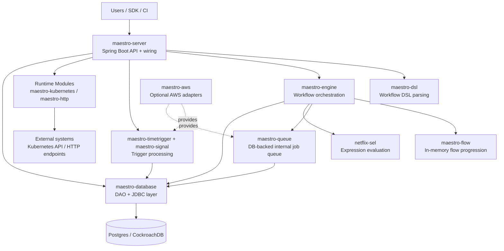

# Maestro Architecture Overview

This repository is a multi-module Gradle project for **Maestro**, a workflow orchestration platform.
At runtime, `maestro-server` composes the core engine, persistence, trigger systems, and pluggable step runtimes.

## What the repo does (high-level)

- Exposes REST APIs to register workflows, start runs, inspect state, and operate instances.
- Stores workflow definitions, instances, and execution metadata in SQL-backed persistence.
- Executes workflows through a DAG/flow engine with internal queue-based job dispatch.
- Supports trigger-driven starts (time-based and signal-based).
- Supports pluggable runtime executors for step types (e.g., Kubernetes, HTTP).
- Includes optional AWS integrations (SQS/SNS based producers/queues).

## Architecture picture

## Module map

- **maestro-server**: app entrypoint, Spring configuration, REST controllers, request interceptors.
- **maestro-engine**: workflow runtime logic, job processors, action handlers, orchestration services.
- **maestro-flow**: high-performance flow progression primitive used by engine.
- **maestro-queue**: internal queue abstraction and workers for asynchronous event/job handling.
- **maestro-signal**: signal trigger/dependency model, DAOs, processors, queue producer interfaces.
- **maestro-timetrigger**: delayed trigger scheduling and execution processing.
- **maestro-database**: DB abstraction and shared JDBC helper/DAO support.
- **maestro-dsl**: workflow DSL model + parsing.
- **netflix-sel**: sandboxed expression language used in dynamic parameters/conditions.
- **maestro-kubernetes / maestro-http**: step runtime implementations.
- **maestro-aws**: optional implementations using AWS services (e.g., SNS/SQS).
- **maestro-common**: shared models, validation, utility classes, and exceptions.

## Typical execution path

1. Client submits workflow definition or action through `maestro-server` REST APIs.
2. Workflow definition is parsed/validated (`maestro-dsl`, `maestro-common`).
3. Engine persists state and enqueues/internal-dispatches job events (`maestro-engine`, `maestro-queue`, `maestro-database`).
4. Flow progression executes steps (`maestro-flow`), evaluating expressions via `netflix-sel`.
5. Step runtimes execute against external systems (`maestro-kubernetes`, `maestro-http`, etc.).
6. Trigger modules (`maestro-timetrigger`, `maestro-signal`) can start new runs or unblock steps.

